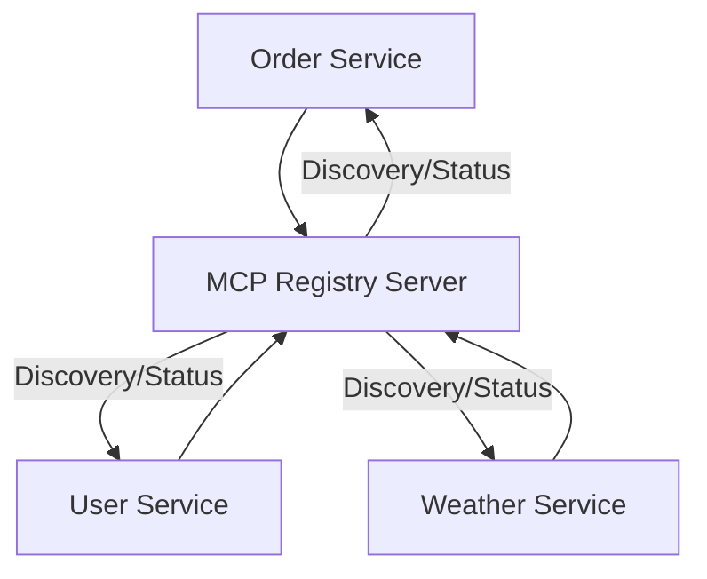

# MCP Demo Apps

This repository contains example applications demonstrating how to use the MCP SDKs and Registry Server.

## Contents

- `java-demo/` – Spring Boot demo with three services:
  - **Order Service**
  - **User Service**
  - **Weather Service**
- _Planned:_
  - `python-demo/` – FastAPI app using the MCP Python SDK
  - `node-demo/` – Express app using the MCP Node SDK

## Quick Start

1. Clone this repo and the [MCP Registry Server](https://github.com/autogentmcp/registry-server).
2. Start the registry server (see its README).
3. In `java-demo/`, follow the instructions in its `README.md` to run the services.

## Architecture

## Related Repositories

- [MCP Registry Server](https://github.com/autogentmcp/registry-server)
- [MCP Core Java SDK](https://github.com/autogentmcp/core-java)
- [MCP Core Python SDK](https://github.com/autogentmcp/core-python) _(coming soon)_
- [MCP Core Node SDK](https://github.com/autogentmcp/core-node) _(coming soon)_
- [Documentation Site](https://your-docs-site-url)

## Contributing

Contributions are welcome! See [CONTRIBUTING.md](CONTRIBUTING.md) for details.

---

_This repo will be updated as new demo apps are added for Python and Node.js._
